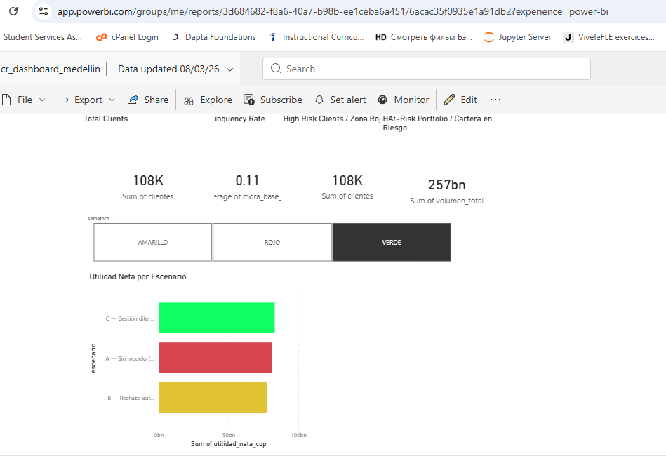

# Data & AI Portfolio — Carlos Restrepo
### Portafolio de Datos e IA — Carlos Restrepo

> Production-grade analytics pipelines, machine learning models, and AI automation workflows built with Python, scikit-learn, n8n, OpenAI, PostgreSQL, Twilio, Google Vision OCR, DuckDB, Plotly, SQLAlchemy, and Power BI · Tableau.
>
> Pipelines de analítica, modelos de machine learning y flujos de automatización con IA de nivel productivo, construidos con Python, scikit-learn, n8n, OpenAI, PostgreSQL, Twilio, OCR de Google Vision, DuckDB, Plotly, SQLAlchemy y Power BI · Tableau.

---

## Projects / Proyectos

| # | Project / Proyecto | Domain | Stack |
|---|-------------------|--------|-------|
| 1 | [Credit Risk — Early Delinquency Model](#project-1) | Data Analytics & ML | Python · scikit-learn · SQLAlchemy · pandas · matplotlib |
| 2 | [Medellín Vehicle Recovery Analysis & Forecasting](#project-2) | Data Analytics & ML | Python · scikit-learn · SQLAlchemy · DuckDB · Plotly · pandas |
| 3 | [Medellín Business Leads Scraper](#project-3) | Data Engineering | Python · Google Maps API · BeautifulSoup · Selenium · pandas |
| 4 | [WhatsApp AI Assistant with Persistent Memory](#project-4) | AI Automation | n8n · OpenAI · PostgreSQL · Twilio |
| 5 | [Automated Invoice Processing (OCR + AI)](#project-5) | AI Automation | n8n · Google Vision · OpenAI · Sheets · Telegram |

---

<a id="project-1"></a>
## Project 1 — Credit Risk: Early Delinquency Model
## Proyecto 1 — Riesgo de Crédito: Modelo de Morosidad Temprana

**EN:** Exploratory analysis and predictive modeling of early delinquency (60-day default within the first 6 months) on a **real credit portfolio of 235,439 records** from one of Colombia's largest consumer electronics and appliance retailers — comparable to Best Buy in the US. Data was ingested and transformed using **SQLAlchemy + pandas** connected to a PostgreSQL database. The project independently evaluates a Random Forest model built around a novel feature: the **IVC (Credit Velocity Index)**, which measures how aggressively a customer has been seeking credit relative to their credit history length. Includes economic threshold optimization, three-scenario P&L comparison, and a committee-ready recommendation.

**ES:** Análisis exploratorio y modelado predictivo de morosidad temprana (default a 60 días en los primeros 6 meses) sobre una **cartera crediticia real de 235,439 registros** de uno de los retailers de electrodomésticos y tecnología más grandes de Colombia — comparable a Best Buy en EE.UU. Los datos fueron ingestados y transformados con **SQLAlchemy + pandas** conectados a una base de datos PostgreSQL. El proyecto evalúa de forma independiente un modelo Random Forest construido alrededor de una feature novedosa: el **IVC (Índice de Velocidad Crediticia)**, que mide qué tan agresivamente un cliente ha buscado crédito en relación con su antigüedad financiera. Incluye optimización económica del umbral, comparación de P&L en tres escenarios y una recomendación lista para comité.

### Key Findings / Hallazgos Clave

| Metric / Métrica | Value / Valor |
|-----------------|---------------|
| Portfolio analyzed / Cartera analizada | **235,439 records · $570B COP** |
| Base early delinquency rate / Tasa base de mora temprana | **11.33%** |
| IVC correlation with delinquency / Correlación IVC con mora | **r = 0.1942** |
| Income correlation with delinquency / Correlación ingresos con mora | **r = −0.003 → no signal / sin señal** |
| Red zone delinquency rate / Tasa de mora zona roja (IVC > 0.09) | **22.1%** |
| Good payers inside red zone / Buenos pagadores dentro de zona roja | **78%** |
| Volume at risk in red zone / Volumen en zona roja | **$86.2B COP (15.1% of portfolio)** |
| Model AUC | **≈ 0.68** |
| Model Recall | **≈ 56%** |

### Business Impact — 3 Scenarios / Impacto de Negocio — 3 Escenarios

| Scenario / Escenario | Net Utility / Utilidad Neta | Delta vs Base |
|---------------------|----------------------------|---------------|
| A — No model / Sin modelo | $81.19B COP | — |
| B — Auto-reject red zone / Rechazo automático zona roja | $77.67B COP | **−$3.52B COP** ← destroys value / destruye valor |
| C — Differentiated management / Gestión diferenciada (recommended) | $82.98B COP | **+$1.79B COP** ← creates value / crea valor |

> **Critical insight / Insight crítico:** Automatically rejecting the entire red zone **destroys $3.52B COP** compared to doing nothing — because 78% of flagged customers are actually good payers. The right action is differentiated treatment: reduced credit limit + adjusted pricing, not binary rejection.
>
> Rechazar automáticamente toda la zona roja **destruye $3.52B COP** respecto a no hacer nada — porque el 78% de los clientes marcados son buenos pagadores. La acción correcta es tratamiento diferenciado: cupo reducido + pricing ajustado, no rechazo binario.

### Operational Risk / Riesgo Operativo
- **91,789 customers** in yellow zone (39% of portfolio) — no operational policy defined / sin política operativa definida
- Estimated **~174 analyst-equivalents/month** to review yellow zone at 20 min/case SLA

### Model Design Decisions / Decisiones de Diseño
- **Random Forest over XGBoost** — preferred for stability and direct rule extraction for credit policy
- **`class_weight='balanced'` over SMOTE** — preserves real probability calibration for provision estimation
- **Income variables excluded** — EDA confirmed near-zero correlation; behavioral signal dominates

### Recommendation / Recomendación
Conditional pilot: **20% of traffic · 2 months · A/B test**. Scale only after: ROI positive · out-of-time validation passed · PSI < 0.15 · yellow zone SLA < 24h operational.

### Pipeline
```
Data Load (SQLAlchemy + PostgreSQL) → Cleaning → IVC Feature Engineering → EDA
→ Traffic-Light Segmentation → Economic Threshold Optimization
→ 3-Scenario P&L → Random Forest → Committee Recommendation
```

### Dashboard / Visualización

*Interactive Power BI dashboard — 4 KPIs + traffic-light slicer + A/B/C scenario analysis*

### Stack
`Python` · `pandas` · `numpy` · `SQLAlchemy` · `PostgreSQL` · `matplotlib` · `seaborn` · `scikit-learn` · `Random Forest` · `IVC Feature Engineering` · `ROC-AUC` · `Power BI` · `Flake8` · `Git`

---

<a id="project-2"></a>
## Project 2 — Medellín Vehicle Recovery Analysis & Forecasting
## Proyecto 2 — Análisis y Pronóstico de Recuperación de Automotores en Medellín

**EN:** End-to-end analytics project on Medellín's open vehicle recovery dataset (2003–2020), built from direct professional experience at the Secretaría de Movilidad. Data was connected and managed via **SQLAlchemy + PostgreSQL** for the 33,500+ historical records before transformation and analysis. Covers the full analytics cycle: ETL, EDA, K-Means clustering of 22 communes by risk profile, three forecasting models (linear, polynomial, EWM) projected to 2025, interactive Plotly dashboards, embedded SQL via DuckDB with window functions, and export-ready datasets for Power BI and Tableau.

**ES:** Proyecto de analítica de extremo a extremo sobre el dataset abierto de recuperación de automotores de Medellín (2003–2020), construido desde la experiencia profesional directa en la Secretaría de Movilidad. Los datos fueron conectados y gestionados mediante **SQLAlchemy + PostgreSQL** para los más de 33,500 registros históricos. Cubre el ciclo analítico completo: ETL, EDA, clustering K-Means de 22 comunas por perfil de riesgo, tres modelos de predicción (lineal, polinomial, EWM) proyectados a 2025, dashboards interactivos con Plotly, SQL embebido con DuckDB con window functions, y datasets listos para Power BI y Tableau.

### Key Findings / Hallazgos Clave

| Metric / Métrica | Value / Valor |
|-----------------|---------------|
| Total historical recoveries / Recuperaciones históricas | **33,517 vehicles / vehículos (2003–2020)** |
| Peak year / Año pico | **2003 — 3,806 vehicles / vehículos** |
| Decline peak to 2020 / Caída del pico a 2020 | **−79.5%** |
| Optimal K / K óptimo (elbow + silhouette) | **K = 3 clusters** |
| High-risk cluster / Cluster de alto riesgo | **Aranjuez · La Candelaria · Laureles-Estadio** |
| Selected forecast model / Modelo seleccionado | **EWM — base scenario to 2025 / escenario base a 2025** |

### Conclusions / Conclusiones
- The **−79.5% sustained decline** reflects real improvements in urban security and mobility policy — not data gaps
- K-Means K=3 cleanly separates communes into **high, medium, and low risk profiles** — directly actionable for resource allocation
- **EWM outperforms** linear and polynomial models in capturing recent trend momentum while being robust to historical volatility
- The 3 high-risk communes concentrate **disproportionate recovery volume** relative to their geographic size

### Pipeline
```
Data Load (SQLAlchemy + PostgreSQL) → ETL & Data Quality → EDA → K-Means Clustering (K=3)
→ Forecasting (Linear · Polynomial · EWM) → Plotly Dashboards
→ DuckDB SQL (RANK · LAG · PARTITION BY) → Power BI / Tableau Export
```

### Capabilities / Capacidades
- Full ETL with data quality report and feature engineering
- 9 static visualizations: heatmaps, cluster scatter, forecast bands
- 2 interactive HTML dashboards (Plotly)
- SQL window functions via DuckDB: `RANK`, `LAG`, `PARTITION BY`
- 4 export-ready CSV files for Power BI and Tableau

### Stack
`Python` · `pandas` · `numpy` · `SQLAlchemy` · `PostgreSQL` · `matplotlib` · `seaborn` · `plotly` · `scikit-learn` · `KMeans` · `DuckDB` · `Power BI` · `Tableau` · `Flake8` · `Git`

### Data Source / Fuente de datos
[Datos Abiertos — Alcaldía de Medellín / MEData](https://medata.gov.co) · Dataset: Recuperación de Automotores por Año y Comuna

---

<a id="project-3"></a>
## Project 3 — Medellín Business Leads Scraper
## Proyecto 3 — Scraper de Leads Empresariales en Medellín

**EN:** Data engineering pipeline that extracts and enriches **70,000+ business records** from Google Maps across 22 zones in Medellín, covering multiple sectors in the health and wellness industry. Uses a three-layer scraping strategy: **Google Maps Places API** for structured business data, **BeautifulSoup** for static site email extraction (prioritizing `mailto:` links over plain-text regex), and **Selenium** as JS-rendered fallback for dynamic sites. Each record is enriched with email, WhatsApp, and Instagram contact data, normalized with regex, and deduplicated by `place_id` to produce a CRM-ready structured database. All code follows production standards: modular Python architecture, Flake8 linting, and Git version control.

**ES:** Pipeline de ingeniería de datos que extrae y enriquece **más de 70,000 registros empresariales** de Google Maps en 22 zonas de Medellín, cubriendo múltiples sectores del sector salud y bienestar. Utiliza una estrategia de scraping en tres capas: **Google Maps Places API** para datos estructurados, **BeautifulSoup** para extracción estática de emails (priorizando links `mailto:` sobre regex plano), y **Selenium** como fallback para sitios renderizados con JS. Cada registro se enriquece con email, WhatsApp e Instagram, normalizado con regex y deduplicado por `place_id` para producir una base de datos estructurada lista para CRM.

### Architecture / Arquitectura
```
Google Maps Places API → Place Details (phone · website)
→ Layer 1: requests + BeautifulSoup (mailto: links → regex on visible text)
→ Layer 2: Selenium JS fallback (dynamic sites · contact page crawling)
→ regex normalization + place_id deduplication
→ Structured Excel / CRM-ready database
```

### Capabilities / Capacidades
- **70,000+ business records** across 22 zones in Medellín metro area
- Multi-sector coverage: Dentistry · Aesthetic Clinics · Physiotherapy · General Medicine · Medical Specialists · Psychology · Optometry · Nutrition · and more
- Three-layer extraction: Google Maps API → BeautifulSoup → Selenium fallback
- Email extraction: `mailto:` links (priority) + regex on visible text only — minimizes false positives
- WhatsApp detection from `wa.me` links and Colombian mobile number patterns (+57)
- Instagram profile extraction from footers and headers
- `place_id` deduplication across all zones and search queries
- Specialty sub-classification for Medical Specialists (Cardiology, Dermatology, Pediatrics, Gynecology, Neurology, etc.) via keyword matching
- Partial save every 10 records to prevent data loss on long runs
- Output columns: Nombre · Dirección · Teléfono · Web · Email · WhatsApp · Instagram · Rating · Zona · Comuna · Categoría · Subcategoría · Especialidad

### Stack
`Python` · `Google Maps Places API` · `BeautifulSoup` · `Selenium` · `pandas` · `requests` · `regex` · `openpyxl` · `Flake8` · `Git`

---

<a id="project-4"></a>
## Project 4 — WhatsApp AI Assistant with Persistent Memory
## Proyecto 4 — Asistente de IA para WhatsApp con Memoria Persistente

**EN:** Fully automated WhatsApp assistant powered by AI that maintains persistent conversation memory, understands user intent, and responds contextually. Deployed via Twilio webhooks and orchestrated through n8n. Production-deployed on Docker/VPS with webhook architecture.

**ES:** Asistente de WhatsApp completamente automatizado que mantiene memoria persistente de conversación, comprende la intención del usuario y responde de forma contextual. Desplegado con webhooks de Twilio y orquestado mediante n8n. Desplegado en producción sobre Docker/VPS.

### Architecture / Arquitectura
```
WhatsApp → Twilio Webhook → n8n → AI Agent (OpenAI) → PostgreSQL Memory → WhatsApp Response
```

### Capabilities / Capacidades
- Persistent conversation memory via PostgreSQL
- Context-aware AI responses via LLM
- Automated WhatsApp message handling
- Production webhook architecture on Docker/VPS
- Scalable workflow orchestration via n8n

### Stack
`n8n` · `OpenAI API` · `PostgreSQL` · `Twilio WhatsApp API` · `Webhooks` · `Docker` · `VPS` · `Git`

---

<a id="project-5"></a>
## Project 5 — Automated Invoice Processing (OCR + AI)
## Proyecto 5 — Procesamiento Automatizado de Facturas (OCR + IA)

**EN:** Fully automated pipeline that extracts structured financial data from invoice images received via Gmail. Combines Google Vision OCR with LLM extraction to convert unstructured images into structured records in Google Sheets, with Telegram notifications.

**ES:** Pipeline totalmente automatizado que extrae datos financieros estructurados de imágenes de facturas recibidas por Gmail. Combina OCR de Google Vision con extracción LLM para convertir imágenes no estructuradas en registros estructurados en Google Sheets, con notificaciones por Telegram.

### Architecture / Arquitectura
```
Gmail → Google Vision OCR → LLM Extraction → Data Normalization → Google Sheets → Telegram Notification
```

### Capabilities / Capacidades
- OCR extraction from invoice images
- Structured JSON generation via LLM
- Automated financial data normalization
- Google Sheets integration + Telegram notifications
- Fully automated email-triggered pipeline

### Stack
`n8n` · `Google Vision OCR` · `OpenAI API` · `Google Sheets API` · `Telegram API` · `Gmail API` · `Git`

---

## Tech Stack / Stack Técnico

| Tool | Role |
|------|------|
| Python | Data pipelines, analytics & ML |
| pandas · numpy | Data manipulation & feature engineering |
| matplotlib · seaborn | Static visualizations & EDA |
| scikit-learn | Machine learning — Random Forest · K-Means |
| plotly | Interactive HTML dashboards |
| SQLAlchemy | ORM — Python-to-PostgreSQL connection & data ingestion |
| PostgreSQL | Persistent memory & relational storage |
| DuckDB | Embedded SQL with window functions (RANK · LAG · PARTITION BY) |
| Power BI · Tableau | Business intelligence dashboards & KPI reporting |
| Excel (Power Query · Power Pivot · VBA) | Advanced financial modeling & data transformation |
| BeautifulSoup | Static HTML parsing & email extraction |
| Selenium | JS-rendered web scraping fallback |
| Google Maps Places API | Geospatial business data extraction |
| n8n | Workflow orchestration & automation |
| OpenAI / LLM | Natural language processing & structured extraction |
| Google Vision OCR | Document & invoice data extraction |
| Google Sheets API | Structured data storage |
| Twilio WhatsApp API | Messaging integration |
| Telegram API | Automated notifications |
| Gmail API | Email-triggered automation |
| Docker / VPS | Production deployment |
| Flake8 | Code linting & quality standards |
| Git | Version control |

---

## Author / Autor

**Carlos Restrepo**
MBA | Data Analytics & AI Automation Engineer | Vancouver, BC, Canada

Specialized in / Especializado en:
- Credit risk analytics & predictive modeling
- Feature engineering from behavioral data
- AI automation & conversational agents
- Intelligent document processing (OCR + LLM)
- End-to-end data pipelines & open data analytics
- Business intelligence dashboards (Power BI · Tableau · Plotly)
- Public sector data engineering & geospatial analytics

🔗 [github.com/ebseducacioncolombia-tech](https://github.com/ebseducacioncolombia-tech)
🔗 [linkedin.com/in/carlos-augusto-restrepo-jimenez](https://www.linkedin.com/in/carlos-augusto-restrepo-jimenez/)
